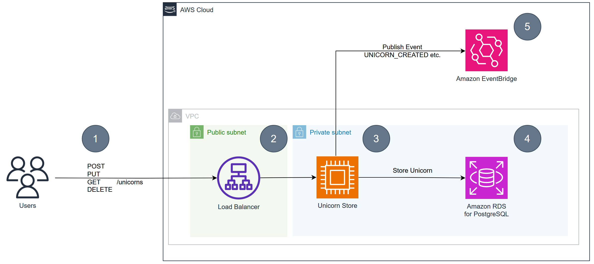

# Java with AWS Challenge

# Pre-Requisites

1. Install [AWS CDK](https://docs.aws.amazon.com/cdk/latest/guide/getting_started.html)
2. Install [AWS CLI](https://docs.aws.amazon.com/cli/latest/userguide/getting-started-install.html)
3. Install [jq](https://stedolan.github.io/jq/download/)
4. Install [artillery](https://www.artillery.io/docs/guides/getting-started/installing-artillery)

# Architecture overview

Throughout this workshop we are going to work with an example application named **UnicornStore**.

The UnicornStore is a **Spring Boot Java Application** that provides CRUD-Operations for Unicorn-Records.
It stores them in a relational database (Postgres) and publishes and event afterwards in an eventbus (EventBridge).



## Setup

The following script will build the infrastructure stack via AWS CDK.

```bash
./setup-infrastructure.sh
```

To deploy locally as a spring boot application:

```bash
./deploy.sh spring-local --build
#./mvnw -P local -f software/unicorn-store-spring/pom.xml spring-boot:run
```

To deploy serverless via AWS:

```bash
./deploy.sh spring-aws --build
```

To run a load test for the Spring-App use the following script:
```bash
./benchmark.sh spring 
```

## Clean up
Run the following commands to clean up your workshop environment:
```bash
cd infrastructure/cdk
cdk destroy --all --force
```
Stack deletion could take 10 minutes or more due to a safe Network Interface deletion process.

You can exit the current terminal and deletion will still continue.

## Your Tasks
Welcome to the Unicorn Store development team!  

We just fired the entire dev team that built the application and getting numerous requests from users.  

Here is a list of tickets for you:

1. Feature Request : as a user, I would like to view all Unicorns in the store.  Acceptance criteria in test-app.sh.
2. Bug : Urgent issue!  No events are being received by the fulfilment team and other down line processes.  We need the events fixed asap. Acceptance criteria: The events should be found in the CloudWatch audit-service-log-group logs.
3. Backlog Nonfunctional requirement : Dev team is having issues testing locally.
4. Feature Request: as the store manager, I would like to receive an email when a unicorn is deleted.
5. Bug
## Security
The project uses [CDK-Nag](https://github.com/cdklabs/cdk-nag) to identify issues with the environment configuration. Since this is workshop environment we are
not using all the capabilities that you might need in production (E.g. Multi-AZ setup). Please refer to the CDK-Nag suppressions in the [CDK-App](infrastructure/cdk/src/main/java/com/unicorn/UnicornStoreApp.java) to identify certain choices
we have made for this setup.